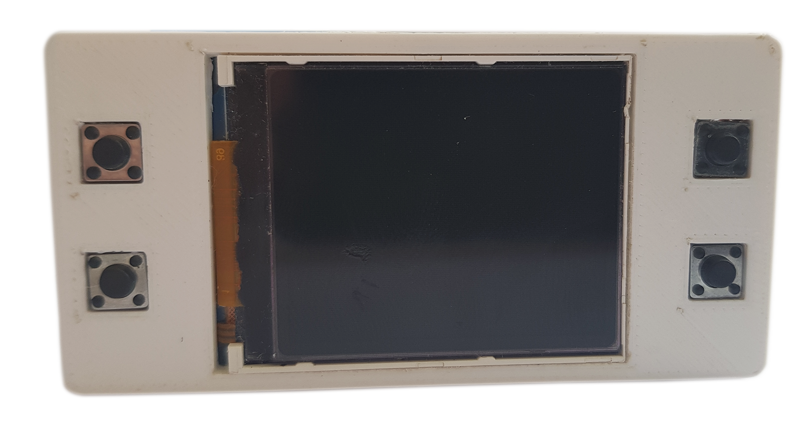
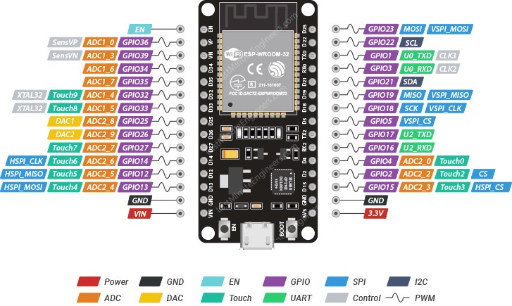

<div align="center">
  <h1>EPS32 based tool for RFID tags</h1> 
  
</div>

---

<h1 align="center">
  TFT_eSPI library setup
</h1>

Uncomment / change these lines at ```.pio/libdeps/esp32-devkitlipo/TFT_eSPI/User_Setup.h```

```
12 #define USER_SETUP_INFO "User_Setup"
47 #define ST7735_DRIVER      // Define additional parameters below for this display
85 #define TFT_WIDTH  128
88 #define TFT_HEIGHT 160
104 #define ST7735_GREENTAB3

168 #define TFT_CS   PIN_D8  // Chip select control pin D8
169 #define TFT_DC   PIN_D3  // Data Command control pin
170 #define TFT_RST  PIN_D4  // Reset pin (could connect to NodeMCU RST, see next line)

206 #define TFT_MOSI 23     //                                          SDA
207 #define TFT_SCLK 18     //                                          SCK
208 #define TFT_CS   15  // Chip select control pin                     CS
209 #define TFT_DC    2  // Data Command control pin |                  RS pin
210 #define TFT_RST   4  // Reset pin (could connect to RST pin)        RES pin

342 #define SPI_FREQUENCY  27000000
348 #define SPI_READ_FREQUENCY  20000000
351 #define SPI_TOUCH_FREQUENCY  2500000

```

<h1 align="center">
  <br>
    ESP32 Pinout
  </br>
  <br>
    
  </br>
</h1>

```
Pinout for RFID RC522 
3V3 - 3.3V/VCC
GND - GND
D19 - RST(RESET)
D5  - SDA(SS)
D23 - MOSI
D19 - MISO
D18 - SCK

Pinout for TZT 1.77 inch TFT LCD screen 128*160
GND - GND  (1) 
3V3 - VCC  (2)  
D18 - SCK  (3)  
D23 - SDA  (4)  
D4  - RES  (5)  
D2  - RS   (6)  
D15 - CS   (7)  
3V3 - LEDA (8)

Pinout for buttons (one button pin to GND the other one to specified ESP32 pin)
D28 - Button-1
D25 - Button-2
D33 - Button-3
D32 - Button-4
```
